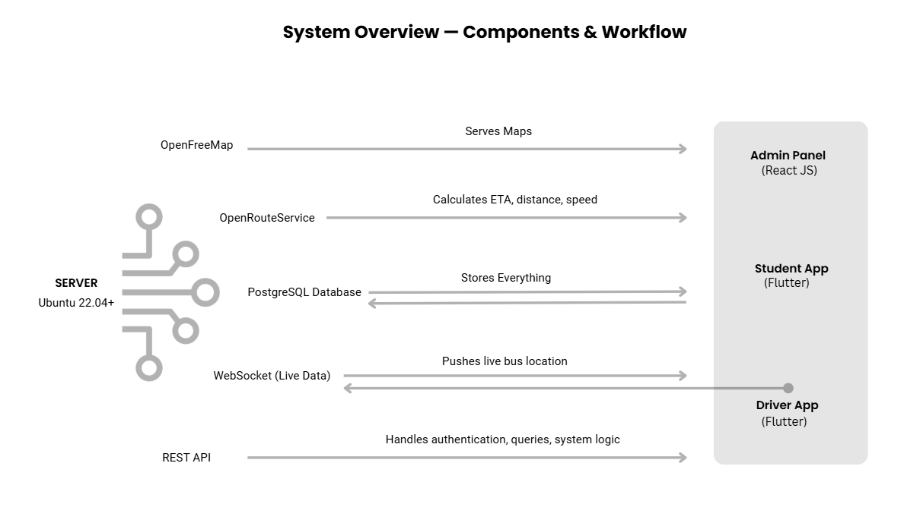

# 🚌 Smart Campus Bus Management System (BusBro)

A technology-driven, self-hosted campus transportation solution designed to make college bus travel smarter, safer, and fully transparent.

Built specifically for large campuses operating multiple buses and routes, this system provides:

- 📍 Real-time bus tracking
- 🔔 Smart arrival alerts
- 🧑‍💼 Centralized admin control
- 🚍 Driver performance monitoring
- 📊 Analytics & reporting
- 🗺 Self-hosted maps & routing engine

---

## 🚨 Problem Statement

Traditional campus transportation systems suffer from:

### 👨‍🎓 For Students
- Dependence on WhatsApp messages or peer calls
- No reliable arrival times
- Missed buses and long waiting times
- Daily stress and uncertainty

### 🧑‍💼 For Transport Admins
- Manual attendance and arrival logging
- No real-time visibility once buses leave campus
- No performance data or analytics
- No system to track delays or efficiency

### 🚍 For Drivers
- No structured trip start/end system
- No performance monitoring
- No emergency reporting mechanism
- Delays go undocumented

---

# 💡 Proposed Solution

The Smart Campus Bus Management System introduces a **3-Application Integrated Architecture**:

| Role | Application |
|------|------------|
| Students | 📱 BusBro (Student App) |
| Drivers | 🚍 Driver App |
| Admin | 🖥 Admin Control Panel |

Each application is purpose-built to automate workflows, reduce stress, and improve reliability across campus transportation.

---

# 🧩 System Architecture Overview

---

# 🧠 Core Features

## 📱 Student App – BusBro
- Live Bus Tracking
- Voice Alerts
- Smart Catch Alarm
- Delay Notifications
- Bus Recovery Tracking

## 🚍 Driver App
- Automated Bus Assignment
- Trip Start / End Logging
- Emergency Reporting
- Real-time Location Sharing
- Performance Monitoring

## 🖥 Admin Panel
- Live Bus Monitoring
- Workload Automation
- Emergency Alerts
- Speed Tracking
- Route Analytics & Reports
- Performance Evaluation

---

# ⚙️ Technology Stack

| Component | Technology |
|------------|------------|
| Student App | Flutter |
| Driver App | Flutter |
| Admin Panel | React.js |
| Backend API | Node.js / Express |
| Database | PostgreSQL |
| Map Tile Server | OpenFreeMap (NGINX + Btrfs) |
| ETA Engine | OpenRouteService |
| Real-time Sync | WebSocket |
| Hosting | Ubuntu Server 22.04 LTS |

---

# 🖥 Server Infrastructure

### Recommended Specifications

| Component | Specification |
|------------|---------------|
| CPU | Intel i9 (12th Gen) / Ryzen 9 (8–16 cores) |
| RAM | 64 GB DDR4+ |
| Storage | 1–2 TB NVMe SSD |
| OS | Ubuntu Server 22.04 LTS |
| Network | 1 Gbps LAN |

---

# 💰 Cost Advantage (Self-Hosting Model)

By eliminating third-party APIs and cloud dependencies:

| Functionality | Monthly Cloud Cost | Self-Hosted Cost |
|---------------|-------------------|-----------------|
| Maps & Tiles | ₹23,000+ | ₹0 |
| Routing & ETA | ₹12,000+ | ₹0 |
| Realtime Sync | ₹5,000–₹10,000 | ₹0 |
| Cloud Database | ₹6,000–₹10,000 | ₹0 |
| **Total** | ₹45,000–₹60,000 / month | One-time Infra Setup |

This makes the system highly scalable and financially sustainable for educational institutions.

---

# 🔐 Security & Reliability

- HTTPS encryption
- Role-based authentication
- Secure trip logging
- Centralized data storage
- Real-time WebSocket validation

---

# 📊 What Makes This Project Unique

- Fully self-hosted infrastructure
- Open-source routing engine
- Real-time multi-app integration
- Analytics-driven transport decisions
- Scalable architecture for large campuses
- Production-level system design

---

# 📁 Repository Structure (Current)

busbro-system/
├── adminpanel/ # React Admin Dashboard
├── backend/ # Node.js API Server
├── routebuilder/ # Route & Map Management
├── livelocationtest/ # Real-time location service

Student App and Driver App are documented separately.

---

# 🎯 Future Scope

- AI-based delay prediction
- Heatmap-based route optimization
- Bus occupancy analytics
- Smart QR-based student boarding
- Push notification integration

---

# 📌 Project Status

🚧 Actively Developed  
🏫 Designed for Large Campus Deployment  
🔓 Open to Collaboration & Feedback

---

# 🤝 Let's Build Smarter Campuses

We welcome feedback, ideas, and technical discussions.

If you are interested in deploying or collaborating, feel free to connect.

---

## 👨‍💻 Developed By
Raji S  
Full Stack Developer | MERN | System Architecture Enthusiast

---
